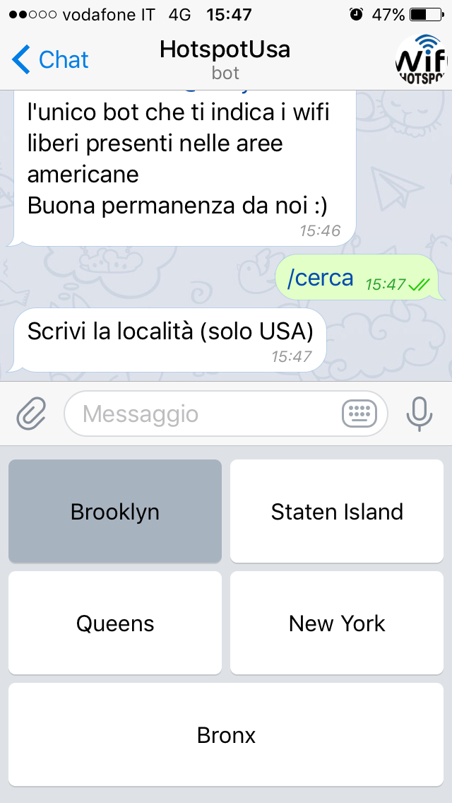
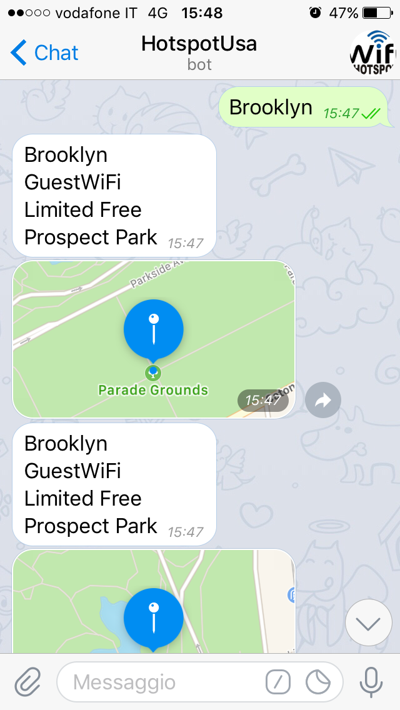

# HotspotsUSA Gratuiti #

## Progetto Piattaforme Digitali per la Gestione del Territorio ##

### Appello: ###
* Primo appello sessione estiva 2017/2018

### Alunno: ###
* [Antonio Colapietro](https://github.com/acolapietro2)

-----------------------------------------------------

## Descrizione ##

Il progetto _HotspotsUSA Gratuiti_ si pone come obiettivi primari:
* Ricerca degli hotspot gratuiti nelle città americane quali Brooklyn, Staten Island, Bronx, Queens e New York.

-----------------------------------------------------

## Relazione ##

Il progetto svolge due funzioni principali:
* La prima consiste nella realizzazione di un API (GET) in NodeJS
* La seconda invece riguarda l'implementazione di un BotTelegram (Python)

<h1>Descrizione API </h1>
In base al luogo scelto ( ovviamente si dovra' scegliere una citta' americana), l'API restituira' l'elenco degli hotspot aperti presenti nelle diverse zone delle citta' scelte.
Il dato di uscita, sara' un file json che conterra' tutte le varie informazioni relativo all'hotspot
Eventuali parametri sono due:
a) hotspot, contenente tutta la lista di tutti gli hotspot di tutte le citta'
b)hotspot, pero' solo in base alla citta' scelta

Per poter utilizzare questo API, mi appoggio alle API di "cityofNewYork.US", che sono in formato json

Le API sono state caricate su heroku
Il Bot di telegram e' stato caricato su un server a pagamento di mia proprieta'

<h2>Bot di telegram </h2>
Per avviare il bot, occorre scaricare l'applicazione di messaggistica chiamata "telegram". Successivamente e' necessario effettuare la ricerca del bot che e' denominato "HotspotUsa";

Successivamente apparira' un messaggio di benvenuto  e un pulsante dove poter cliccare avvia

Appariranno due opzioni, la prima quella di poter effettuare la ricerca e la seconda quella di poter avviare la ricerca con gps

Quando si clicca su cerca appaiono diverse localita' su cui e' possibile effettuare la scelta

